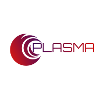

## Introduction

A FastAI-like utility library built on top of Pytorch.
The main intent behind Plasma is to make your daily deep learning work easy.

It should be simple to understand and use. 

Some inspiration taken from Ian Pointer's [Programming PyTorch Deep Learning Applications](https://www.amazon.com/Programming-PyTorch-Deep-Learning-Applications/dp/1492045357). 

___
## Installation

...
___
## Examples

Check out the simple example on how to use Plasma in `examples/simple_example.ipynb`
___

🌟If you would like to contribute, don't hesitate to fork and make pull request!
